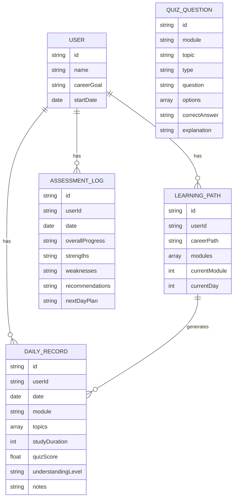

## 1. Architecture Design
```mermaid
graph TB
    subgraph "Frontend Layer"
        A[React App]
        B[Components]
        C[Pages]
        D[State Management]
        E[Local Storage]
    end
    
    subgraph "Data Layer"
        F[Learning Data]
        G[Progress Records]
        H[Quiz Questions]
        I[Assessment Logs]
    end
    
    A --&gt; B
    A --&gt; C
    C --&gt; D
    D --&gt; E
    E --&gt; F
    E --&gt; G
    E --&gt; H
    E --&gt; I
```

## 2. Technology Description
- Frontend: React@18 + TypeScript + tailwindcss@3 + vite
- Initialization Tool: vite-init
- Backend: None (使用 LocalStorage 进行数据存储)
- Database: LocalStorage (浏览器本地存储)
- State Management: Zustand
- Routing: React Router DOM
- Icons: Lucide React

## 3. Route Definitions
| Route | Purpose |
|-------|---------|
| / | 首页仪表板 - 学习进度概览和今日任务 |
| /learn | 学习页面 - 知识点讲解和互动学习 |
| /quiz | 测验页面 - 每日题目和答案评估 |
| /reports | 进度报告页面 - 学习记录和评估报告 |
| /settings | 学习路径设置 - 目标设置和节奏调整 |

## 4. API Definitions (if backend exists)
不适用 - 使用本地存储

## 5. Server Architecture Diagram (if backend exists)
不适用

## 6. Data Model
### 6.1 Data Model Definition


### 6.2 Data Definition Language
由于使用 LocalStorage，以下是 TypeScript 类型定义：

```typescript
// 用户信息
interface User {
  id: string;
  name: string;
  careerGoal: 'frontend' | 'backend' | 'fullstack' | 'algorithm' | 'devops';
  startDate: string;
}

// 学习路径
interface LearningPath {
  id: string;
  userId: string;
  careerPath: string;
  modules: LearningModule[];
  currentModule: number;
  currentDay: number;
}

// 学习模块
interface LearningModule {
  id: string;
  name: string;
  description: string;
  topics: Topic[];
  durationDays: number;
}

// 知识点
interface Topic {
  id: string;
  name: string;
  content: string;
  examples: string[];
  difficulty: 'beginner' | 'intermediate' | 'advanced';
}

// 每日记录
interface DailyRecord {
  id: string;
  userId: string;
  date: string;
  module: string;
  topics: string[];
  studyDuration: number;
  quizScore: number;
  understandingLevel: 'excellent' | 'good' | 'fair' | 'needs_work';
  notes: string;
}

// 测验题目
interface QuizQuestion {
  id: string;
  module: string;
  topic: string;
  type: 'multiple_choice' | 'single_choice' | 'short_answer';
  question: string;
  options?: string[];
  correctAnswer: string;
  explanation: string;
}

// 评估日志
interface AssessmentLog {
  id: string;
  userId: string;
  date: string;
  overallProgress: string;
  strengths: string[];
  weaknesses: string[];
  recommendations: string[];
  nextDayPlan: string;
}
```

### 6.3 Initial Data
系统预置计算机职业方向的学习内容，包括：
- 前端开发：HTML, CSS, JavaScript, React, Vue 等
- 后端开发：Node.js, Python, Java, 数据库等
- 全栈开发：前后端结合
- 算法：数据结构与算法
- DevOps：Git, Docker, CI/CD 等

每个方向包含系统化的学习模块和知识点，以及配套的测验题目。
