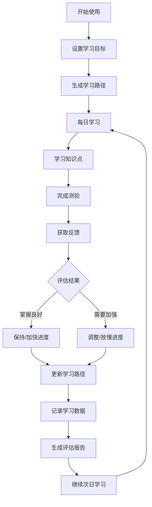

## 1. Product Overview
AI赋能1对1系统化学习平台，针对计算机职业方向，提供个性化学习路径、每日知识点讲解、智能测验与进度调整功能，帮助用户高效学习并提前就业。
- 解决传统学习缺乏个性化、进度僵化、反馈不及时的问题，目标用户为计算机专业学生和转行学习者
- 帮助用户系统性掌握计算机知识，加速就业准备，提升学习效率和成果质量

## 2. Core Features

### 2.1 User Roles (if applicable)
| Role | Registration Method | Core Permissions |
|------|---------------------|------------------|
| 学习者 | 本地存储记录 | 使用所有学习功能、查看进度报告、回答测验 |

### 2.2 Feature Module
1. **首页仪表板**：学习进度概览、今日学习任务、学习路径展示
2. **学习页面**：知识点讲解、互动学习、进度标记
3. **测验页面**：每日题目、答案提交、即时反馈
4. **进度报告页面**：每日学习记录、评估报告、日志导出
5. **学习路径设置**：职业目标选择、技能规划、学习节奏调整

### 2.3 Page Details
| Page Name | Module Name | Feature description |
|-----------|-------------|---------------------|
| 首页仪表板 | 进度概览 | 展示整体学习进度、已掌握知识点、待学习内容 |
| 首页仪表板 | 今日任务 | 显示当日学习目标、建议学习时长、重要知识点 |
| 学习页面 | 知识点讲解 | 分模块展示计算机知识点，包含概念、示例、实践指导 |
| 学习页面 | 进度标记 | 允许用户标记已理解、需复习、已掌握状态 |
| 测验页面 | 题目展示 | 根据当日学习内容生成相关题目，支持单选、多选、简答题 |
| 测验页面 | 答案评估 | 智能评估答案正确性，提供详细解析和建议 |
| 进度报告页面 | 学习记录 | 按日期展示每日学习内容、学习时长、测验成绩 |
| 进度报告页面 | 评估报告 | 生成中文学习评估报告，分析优势、不足和改进建议 |
| 学习路径设置 | 目标设置 | 选择计算机职业方向（前端、后端、全栈、算法等） |
| 学习路径设置 | 节奏调整 | 根据测验结果自动或手动调整后续学习进度 |

## 3. Core Process
用户打开应用后，首先设置学习目标和职业方向。系统根据目标生成初始学习路径。每日学习流程：查看今日任务→学习知识点→完成测验→查看反馈→系统调整次日进度。所有学习数据被记录，可随时查看进度报告和评估日志。

## 4. User Interface Design
### 4.1 Design Style
- 主色调：深蓝色 (#1e3a5f) 代表专业和科技感，辅以明亮的青色 (#00d4aa) 作为强调色
- 按钮风格：圆角矩形，带有微妙的阴影和悬停效果，体现现代感
- 字体：使用 Noto Sans SC 中文和 Inter 英文搭配，标题使用较粗字重，正文保持清晰易读
- 布局风格：卡片式设计，清晰的信息层级，大量留白提升可读性
- 图标风格：使用线性图标，简洁现代，与整体设计风格统一

### 4.2 Page Design Overview
| Page Name | Module Name | UI Elements |
|-----------|-------------|-------------|
| 首页仪表板 | 进度概览 | 大型进度环、统计卡片、渐变背景、柔和动画 |
| 首页仪表板 | 今日任务 | 任务列表卡片、倒计时元素、完成状态指示 |
| 学习页面 | 知识点讲解 | 分栏布局、代码高亮、交互式示例、折叠/展开面板 |
| 测验页面 | 题目展示 | 问题卡片、选项按钮、提交动画、进度条 |
| 进度报告页面 | 学习记录 | 时间线布局、数据图表、日志卡片、导出按钮 |
| 学习路径设置 | 目标设置 | 选项卡片、滑块控件、预览区域、确认按钮 |

### 4.3 Responsiveness
桌面优先设计，适配平板和移动设备。使用响应式网格系统，在小屏幕上重新排列内容，确保触控友好的交互元素尺寸。

### 4.4 3D Scene Guidance (if applicable)
不适用
